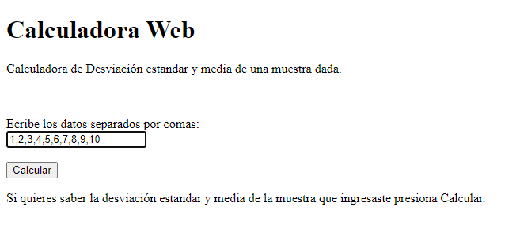
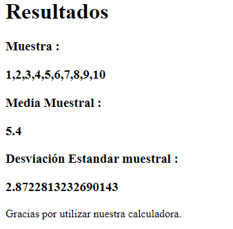

# Calculadora Web

Esta aplicación usa una implementación de una LinkedList para realizar unas operaciones matematicas
(Media y desviación estandar muestral) y la despliega en Heroku.

### Pre-requisitos

- [Maven](https://maven.apache.org/) : Con esta herramienta se creo la estructura del proyecto y se manejan las dependencias que se necesitan

- [Git](https://git-scm.com/) : Sistema distribuido de manejo de versiones que usaremos tanto en este taller como en lo que resta del curso

Cabe resaltar que es importante que las versiones del JDK de java sean las requeridas para poder instalar
maven ya que si no es actual no se puede instalar las versiones actuales de maven y esto puede desencadenar en problemas
al momento de usar la herramienta.
¿Como revisar la version del JDK?

```
java -version 
```

### Instalación

Para poder instalar el programa debe clonar el repositorio en su maquina local, ejecutando el siguiente comando
en la linea de comandos:

```
https://github.com/cvillamiljr/LAB02-AREP.git
```
### Ejecución
- Previo a la ejecución del proyecto debe empaquetar el proyecto.
- Acceda a la carpeta linkedList
- Una vez dentro de la carpeta proceda a ejecutar el siguiente comando para empaquetar el proyecto:
```
mvn package
```
- Ya que el proyecto esta empaquetado, proceda a ejecutar el proyecto usando el siguiente comando:
```
java -cp target/SparkWeb-1.0-SNAPSHOT.jar edu.escuelaing.arep.SparkWeb
```
Nota: Recuerde que -cp hace referencia al classpath de la clase que se va a ejecutar, en este caso es la clase SparkWeb.

- Es importante mencionar que para poder acceder a la visualiazación de la applicación debemos hacerlo de la siguiente manera:
```
localhost:4567
```
- De esta forma podremos ver el funcionamiento de nuestra aplicación de manera local sin necesidad de usar una herramienta de despliegue.

Los resultados que obtendrá seran los siguientes:

- Pagina donde se debe ingresar la muestra:



- Pagina de los resultados luego de realizar las operaciones:



## Ejecución de pruebas

Una vez se haya ejecutado el proyecto y todo haya salido bien, proceda a ejecutar las pruebas con el siguiente comando:

```
mvn test
```

## Construido con

Este proyecto se llevo a cabo con la ayuda de las siguientes herramientas:
- [Spark](http://sparkjava.com/) : Spark - Un micro framework para crear aplicaciones web en Kotlin y Java 8 con el mínimo esfuerzo
- [Maven](https://maven.apache.org/) : Herramienta para la creacion de la estructura del proyecto y el manejo de las dependencias en el mismo.
- [Git](https://git-scm.com/) : Sistema distribuido de manejo de versiones que usaremos tanto en este taller como en lo que resta del curso
- [Heroku](https://dashboard.heroku.com/apps) : Herramienta para realizar despliegues continuos [](https://sheltered-retreat-04173.herokuapp.com)
- [CircleCi](https://circleci.com/) : Herramienta para realizar integracion continua [](https://app.circleci.com/pipelines/github/cvillamiljr/LAB02-AREP)

## Author 

- [Cesar Villamil Ramos](https://github.com/cvillamiljr)

## Lincencia

- Este proyecto esta licenciado por GNU General Public License v3.0 .